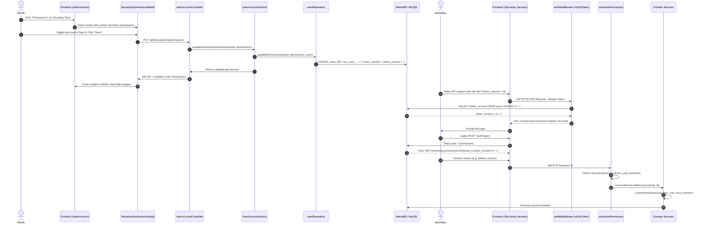

# Technical Design Document: Granular Secretary Permissions Matrix (RBAC)

## 1. Executive Summary

This document details the technical architecture, data model, backend API/middleware logic, domain service authorization refactoring, frontend component tree, and end-to-end testing strategy for implementing a granular Role-Based Access Control (RBAC) matrix for secretary accounts (`granular-secretary-permissions`).

This change transitions the application from a dual model (global `system_settings` toggles + isolated `can_manage_users` flag) to a unified, per-user 8-permission matrix stored directly on `users`, embedded into JWT claims, enforced across route middlewares and domain services, and managed via an atomic modal UI in the admin panel.

---

## 2. Architecture & Data Flow



---

## 3. Database Migration & Schema Design

### 3.1 Schema Additions (`users` table)

The `users` table is expanded with 7 new boolean columns alongside the existing `can_manage_users` column:

```sql
ALTER TABLE users
  ADD COLUMN can_crud_appointments TINYINT(1) NOT NULL DEFAULT 0,
  ADD COLUMN can_edit_past_appointments TINYINT(1) NOT NULL DEFAULT 0,
  ADD COLUMN can_crud_requests TINYINT(1) NOT NULL DEFAULT 0,
  ADD COLUMN can_crud_prescriptions TINYINT(1) NOT NULL DEFAULT 0,
  ADD COLUMN can_crud_licenses TINYINT(1) NOT NULL DEFAULT 0,
  ADD COLUMN can_crud_files TINYINT(1) NOT NULL DEFAULT 0,
  ADD COLUMN can_crud_finances TINYINT(1) NOT NULL DEFAULT 0;
```

### 3.2 Matrix Definition

| Column | Type | Default | Description |
|---|---|---|---|
| `can_manage_users` | `TINYINT(1)` | `0` | Allows access to `/admin/users` and user CRUD operations. |
| `can_crud_appointments` | `TINYINT(1)` | `0` | Allows creating, rescheduling, modifying, and cancelling appointments. |
| `can_edit_past_appointments` | `TINYINT(1)` | `0` | Allows modifying or cancelling appointments with a past date. |
| `can_crud_requests` | `TINYINT(1)` | `0` | Allows creating, editing, and deleting patient medical study requests. |
| `can_crud_prescriptions` | `TINYINT(1)` | `0` | Allows creating, editing, and deleting medical prescriptions. |
| `can_crud_licenses` | `TINYINT(1)` | `0` | Allows creating, extending, and deleting medical certificates/licenses. |
| `can_crud_files` | `TINYINT(1)` | `0` | Allows uploading and deleting patient medical attachments/files. |
| `can_crud_finances` | `TINYINT(1)` | `0` | Allows creating transactions, editing debts, and managing cash registers. |

### 3.3 Safe Data Migration & Initialization Script

To avoid disrupting existing secretaries, the migration copies initial values from current `system_settings` to all users with `role = 'secretary'`:

```sql
-- Migration: Populate existing secretaries from system_settings
UPDATE users u
CROSS JOIN (
  SELECT 
    MAX(CASE WHEN setting_key = 'enable_secretary_crud_appointments' THEN setting_value = 'true' OR setting_value = '1' END) AS can_crud_appointments,
    MAX(CASE WHEN setting_key = 'allow_secretary_edit_past_appointments' THEN setting_value = 'true' OR setting_value = '1' END) AS can_edit_past_appointments,
    MAX(CASE WHEN setting_key = 'enable_secretary_crud_requests' THEN setting_value = 'true' OR setting_value = '1' END) AS can_crud_requests,
    MAX(CASE WHEN setting_key = 'enable_secretary_crud_prescriptions' THEN setting_value = 'true' OR setting_value = '1' END) AS can_crud_prescriptions,
    MAX(CASE WHEN setting_key = 'enable_secretary_crud_licenses' THEN setting_value = 'true' OR setting_value = '1' END) AS can_crud_licenses,
    MAX(CASE WHEN setting_key = 'enable_secretary_crud_files' THEN setting_value = 'true' OR setting_value = '1' END) AS can_crud_files,
    MAX(CASE WHEN setting_key = 'enable_secretary_finance_crud' THEN setting_value = 'true' OR setting_value = '1' END) AS can_crud_finances
  FROM system_settings
) s
SET 
  u.can_crud_appointments = COALESCE(s.can_crud_appointments, 0),
  u.can_edit_past_appointments = COALESCE(s.can_edit_past_appointments, 0),
  u.can_crud_requests = COALESCE(s.can_crud_requests, 0),
  u.can_crud_prescriptions = COALESCE(s.can_crud_prescriptions, 0),
  u.can_crud_licenses = COALESCE(s.can_crud_licenses, 0),
  u.can_crud_files = COALESCE(s.can_crud_files, 0),
  u.can_crud_finances = COALESCE(s.can_crud_finances, 0),
  u.token_version = u.token_version + 1
WHERE u.role = 'secretary';
```

---

## 4. Backend Architecture & Service Layer

### 4.1 Permission Keys & Normalization Constants

Create/update `server/constants/permissions.js`:
```javascript
const PERMISSION_KEYS = [
  'can_manage_users',
  'can_crud_appointments',
  'can_edit_past_appointments',
  'can_crud_requests',
  'can_crud_prescriptions',
  'can_crud_licenses',
  'can_crud_files',
  'can_crud_finances'
];

const PERMISSION_CAMEL_MAP = {
  canManageUsers: 'can_manage_users',
  canCrudAppointments: 'can_crud_appointments',
  canEditPastAppointments: 'can_edit_past_appointments',
  canCrudRequests: 'can_crud_requests',
  canCrudPrescriptions: 'can_crud_prescriptions',
  canCrudLicenses: 'can_crud_licenses',
  canCrudFiles: 'can_crud_files',
  canCrudFinances: 'can_crud_finances'
};

module.exports = { PERMISSION_KEYS, PERMISSION_CAMEL_MAP };
```

### 4.2 Authentication & JWT Claims (`authService.js`)

1. **Token Generation Payload**:
   Update `_generateToken` to encode all permissions into the JWT payload:
   ```javascript
   _generateToken(userId, username, role, version, permissions = {}) {
       return jwt.sign(
           {
               user_id: userId,
               username,
               role,
               token_version: version,
               permissions: {
                   can_manage_users: Boolean(permissions.can_manage_users),
                   can_crud_appointments: Boolean(permissions.can_crud_appointments),
                   can_edit_past_appointments: Boolean(permissions.can_edit_past_appointments),
                   can_crud_requests: Boolean(permissions.can_crud_requests),
                   can_crud_prescriptions: Boolean(permissions.can_crud_prescriptions),
                   can_crud_licenses: Boolean(permissions.can_crud_licenses),
                   can_crud_files: Boolean(permissions.can_crud_files),
                   can_crud_finances: Boolean(permissions.can_crud_finances)
               },
               // Backwards compatibility alias
               canManageUsers: Boolean(permissions.can_manage_users)
           },
           process.env.JWT_SECRET,
           { expiresIn: "24h" }
       );
   }
   ```
2. **Login Response**: Return the `permissions` dictionary in the login JSON response for direct frontend client consumption.

### 4.3 Route Middleware (`server/middleware/authorize.js`)

Replace bespoke handlers with a composable `authorizePermission` helper:

```javascript
const { ROLES } = require('../constants/roles');

/**
 * Authorizes admins unconditionally, or secretaries if they hold the specific permission flag.
 * @param {string} permissionKey e.g. 'can_crud_licenses'
 */
const authorizePermission = (permissionKey) => {
    return (req, res, next) => {
        const user = req.user;
        if (!user) {
            return res.status(401).json({ message: "No autenticado" });
        }

        if (user.role === ROLES.ADMIN) {
            return next();
        }

        if (user.role === ROLES.SECRETARY) {
            const hasPerm = Boolean(
                user.permissions?.[permissionKey] || 
                user[permissionKey]
            );
            if (hasPerm) {
                return next();
            }
        }

        return res.status(403).json({ message: "Acceso denegado: permisos insuficientes" });
    };
};

const authorizeCanManageUsers = authorizePermission('can_manage_users');

module.exports = { authorize, authorizePermission, authorizeCanManageUsers };
```

### 4.4 Repository Layer (`userRepository.js`)

Add repository methods to query and persist granular permissions:

```javascript
async getSecretaryPermissions(userId, conn = pool) {
    const rows = await conn.query(
        `SELECT id, username, role, can_manage_users, can_crud_appointments, 
                can_edit_past_appointments, can_crud_requests, can_crud_prescriptions, 
                can_crud_licenses, can_crud_files, can_crud_finances 
         FROM users 
         WHERE id = ? AND role = 'secretary'`,
        [userId]
    );
    return rows[0] || null;
}

async updatePermissions(userId, permissions, conn = pool) {
    const fields = [];
    const values = [];

    const allowedKeys = [
        'can_manage_users', 'can_crud_appointments', 'can_edit_past_appointments',
        'can_crud_requests', 'can_crud_prescriptions', 'can_crud_licenses',
        'can_crud_files', 'can_crud_finances'
    ];

    for (const key of allowedKeys) {
        if (permissions[key] !== undefined) {
            fields.push(`${key} = ?`);
            values.push(permissions[key] ? 1 : 0);
        }
    }

    if (fields.length === 0) return false;

    // Bump token_version for eviction
    fields.push('token_version = token_version + 1');
    values.push(userId);

    const query = `UPDATE users SET ${fields.join(', ')} WHERE id = ?`;
    const result = await conn.query(query, values);
    return result.affectedRows > 0;
}
```

### 4.5 Controller & Route Layer

- `GET /admin/users/permissions`: Returns permission matrix for all secretaries.
- `GET /admin/users/:id/permissions`: Returns permissions for a single secretary.
- `PUT /admin/users/:id/permissions`: Validates and applies permission updates, bumping `token_version`.

### 4.6 Adapting Domain Services

1. **`appointmentHelper.js`**:
   - Inspect `user.permissions.can_crud_appointments` (or `user.can_crud_appointments`).
   - For appointments in the past (`apptDate < now`), check `user.permissions.can_edit_past_appointments`.
2. **`PrescriptionService.js`**:
   - When deleting/editing prescriptions as secretary, verify `req.user.permissions?.can_crud_prescriptions`.
3. **`LicenseService.js`**:
   - Refactor `_checkPermissions(conn, user, doctorId)` to check `user.permissions?.can_crud_licenses` when role is `secretary`.
4. **`MedicalFileService.js`**:
   - Check `user.permissions?.can_crud_files` before file deletion/upload operations.
5. **`MedicalRequestService.js`**:
   - Check `user.permissions?.can_crud_requests` before mutation operations.
6. **`financeService.js` / `billingService.js`**:
   - Guard transaction modifications and cash register balancing with `authorizePermission('can_crud_finances')` / `user.permissions?.can_crud_finances`.

---

## 5. Frontend Architecture & State Management

### 5.1 Component Tree Modifications

```
AdminUsersPage
├── TabNav (Secretaries / Doctors)
├── Aside (Actions: Add User, Refresh)
└── UserManagement (Tab 1)
    ├── UserFilters
    ├── UserTable
    │   ├── UserRow
    │   │   ├── User Info & Role Badge
    │   │   ├── Permissions Column: Badge Pills (Turnos, Recetas, etc.)
    │   │   └── Actions: [Permissions Modal Button] [Edit] [Reset] [Delete]
    └── SecretaryPermissionsModal (New)
        ├── Checkbox / Toggle Grid (8 Granular Permissions)
        ├── Descriptive Helper Texts
        └── Action Buttons (Save, Cancel)
```

### 5.2 `SecretaryPermissionsModal.jsx` (New)

- **Props**: `isOpen`, `onClose`, `secretary`, `onSaveSuccess`.
- **State**: Local state for the 8 boolean keys, initialized with `secretary.permissions` or row attributes.
- **Visuals**: 2-column or list layout with atomic `Checkbox`/`ToggleSwitch` items, info icons, and tooltips.
- **Actions**:
  - `Save`: Dispatches `PUT /admin/users/:id/permissions` via `api.put`. Shows loading spinner; on success invokes `onSaveSuccess` to refresh users list, displays toast notification, and closes.
  - `Cancel`: Discards local edits and closes modal.

### 5.3 `UserTable.jsx` Permission Badges & Actions

- Render individual compact badge tags in the `Permissions` column for secretaries:
  - `can_manage_users` -> Badge "Usuarios"
  - `can_crud_appointments` -> Badge "Turnos"
  - `can_edit_past_appointments` -> Badge "Turnos Pasados"
  - `can_crud_requests` -> Badge "Solicitudes"
  - `can_crud_prescriptions` -> Badge "Recetas"
  - `can_crud_licenses` -> Badge "Licencias"
  - `can_crud_files` -> Badge "Archivos"
  - `can_crud_finances` -> Badge "Finanzas"
- If no permissions granted: Show muted text `"Sin permisos operativos"`.
- Add a dedicated `<Button variant="ghost" icon={<Icon name="tune" />} onClick={() => onOpenPermissions(user)} />` action button.

### 5.4 Removal of Obsolete Components

- Completely remove `SecretaryGlobalPermissionsPanel.jsx` and its references from `AdminUsersPage.jsx`.
- Deprecate / remove bulk sidebar `SecretaryPermissionsPanel.jsx` in favor of per-secretary modal management.

### 5.5 Refactoring `usePermissions.js`

Simplify `usePermissions` to read synchronously from the authenticated `user` object and JWT payload without network round-trips:

```javascript
export const usePermissions = () => {
    const { user, logout } = useAuth();
    const isAdmin = user?.role === 'admin';
    const isSecretary = user?.role === 'secretary';

    const permissions = {
        canManageUsers: isAdmin || Boolean(user?.permissions?.can_manage_users ?? user?.can_manage_users),
        canCrudAppointments: isAdmin || (isSecretary && Boolean(user?.permissions?.can_crud_appointments)),
        canEditPastAppointments: isAdmin || (isSecretary && Boolean(user?.permissions?.can_edit_past_appointments)),
        canCrudRequests: isAdmin || (isSecretary && Boolean(user?.permissions?.can_crud_requests)),
        canCrudPrescriptions: isAdmin || (isSecretary && Boolean(user?.permissions?.can_crud_prescriptions)),
        canCrudLicenses: isAdmin || (isSecretary && Boolean(user?.permissions?.can_crud_licenses)),
        canCrudFiles: isAdmin || (isSecretary && Boolean(user?.permissions?.can_crud_files)),
        canCrudFinances: isAdmin || (isSecretary && Boolean(user?.permissions?.can_crud_finances)),
    };

    return {
        ...permissions,
        loading: false,
        isAdmin,
        isSecretary,
        isDoctor: user?.role === 'doctor',
        isPatient: user?.role === 'patient',
        isStaff: isAdmin || isSecretary,
        isMedicalStaff: isAdmin || isSecretary || user?.role === 'doctor',
        user,
        logout
    };
};
```

---

## 6. Testing Strategy

### 6.1 Backend Automated Tests

1. **Unit / Middleware Tests (`authorize.test.js`)**:
   - `authorizePermission('can_crud_licenses')` allows `admin` role without checking flags.
   - Allows `secretary` with `can_crud_licenses = true`.
   - Rejects `secretary` with `can_crud_licenses = false` with 403 Forbidden.
   - Rejects other roles (patient, doctor) with 403 Forbidden.
2. **Controller & Service Tests (`userAccountController.test.js`, `UserAccountService.test.js`)**:
   - Updating permissions updates database columns and increments `token_version`.
   - Rejects updates with non-boolean values (400 Bad Request).
   - Rejects non-admin update attempts (403 Forbidden).
3. **Domain Service Tests**:
   - `LicenseService.test.js`: Secretary without `can_crud_licenses` fails to delete license.
   - `appointmentHelper.test.js`: Secretary without `can_edit_past_appointments` fails to edit past appointment.
   - `MedicalFileService.test.js`: Secretary without `can_crud_files` fails to delete patient file.

### 6.2 Frontend Component Tests

1. **`SecretaryPermissionsModal.test.jsx`**:
   - Renders 8 checkboxes initialized with the secretary's permissions.
   - Clicking save sends `PUT /admin/users/:id/permissions` with the modified state.
   - Closing without saving emits no API request.
2. **`UserTable.test.jsx`**:
   - Renders appropriate badges for active permissions.
   - Triggers permissions modal callback when the permissions button is clicked.
3. **`usePermissions.test.js`**:
   - Correctly derives permission booleans from auth state without making `/settings` HTTP calls.

---

## 7. Migration & Rollback Strategy

1. **Deployment Steps**:
   - Execute database migration adding 7 columns to `users` and synchronizing initial values from `system_settings`.
   - Deploy backend API with updated JWT token generation and `authorizePermission` middleware.
   - Deploy frontend SPA with `SecretaryPermissionsModal` and refactored `usePermissions`.
2. **Rollback Steps**:
   - Revert frontend and backend deployments to restore `system_settings` checks.
   - Optionally drop added columns: `ALTER TABLE users DROP COLUMN can_crud_appointments, DROP COLUMN can_edit_past_appointments, DROP COLUMN can_crud_requests, DROP COLUMN can_crud_prescriptions, DROP COLUMN can_crud_licenses, DROP COLUMN can_crud_files, DROP COLUMN can_crud_finances;`.
