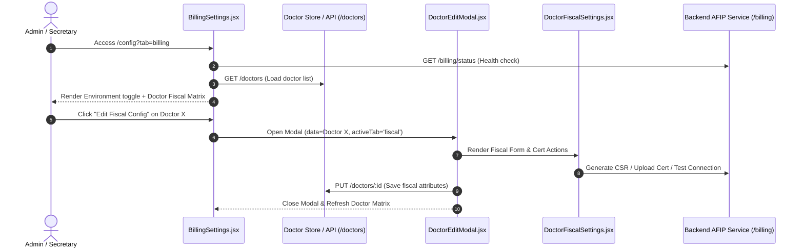

# Technical Design: Doctor Fiscal Settings & Configuration Role Access

## Technical Approach
In our multi-doctor clinic model, AFIP credentials (CUIT, certificates, private keys, points of sale) belong to individual doctor entities rather than a monolithic clinic account. We refactor the system billing configuration (`/config?tab=billing`) into a global environment orchestrator (`afip_environment` testing vs. production) coupled with a reactive Doctor Fiscal Status Overview table. Individual doctor credentials remain edited via [DoctorEditModal.jsx](file:///home/jmro/secretary-app/client/src/features/doctors/components/modals/DoctorEditModal.jsx) with `activeTab="fiscal"` (delegating to [DoctorFiscalSettings.jsx](file:///home/jmro/secretary-app/client/src/features/doctors/components/sections/DoctorFiscalSettings.jsx)).

We also align role authorization in [ConfigRegistryLoader.jsx](file:///home/jmro/secretary-app/client/src/features/config/components/ConfigRegistryLoader.jsx) to grant `['admin', 'secretary']` access across all four configuration sections (`modules`, `communications`, `integrations`, `billing`).

## Architecture Decisions
- **Decoupled Fiscal Scopes**: Global parameters (`afip_environment`) are stored in clinic settings via `/config/settings`, while doctor fiscal certificates and POS reside on doctor records (`/doctors/:id`).
- **Doctor Overview in Billing Settings**: [BillingSettings.jsx](file:///home/jmro/secretary-app/client/src/features/config/components/sections/BillingSettings.jsx) fetches the doctor collection (`/doctors` or uses `useDoctorStore`/`api.get('/doctors')`) to render a status matrix with status badges (`Ready` vs `Incomplete`).
- **Direct Modal Hooking**: Clicking the "Edit" action from any doctor row in `BillingSettings` opens `DoctorEditModal` pre-selected to the `fiscal` tab, reusing existing CSR generation and certificate upload workflows without code duplication.
- **Consistent RBAC**: Both `admin` and `secretary` roles receive permissions `['admin', 'secretary']` across all registered configuration sections in `ConfigRegistryLoader.jsx`.

## Data Flow


## File Changes

| File Path | Action | Description |
|---|---|---|
| [BillingSettings.jsx](file:///home/jmro/secretary-app/client/src/features/config/components/sections/BillingSettings.jsx) | Modify | Remove legacy global doctor CUIT/cert inputs; add `afip_environment` toggle, AFIP server status checker, and Doctor Fiscal Status table with edit actions. |
| [BillingSettings.module.css](file:///home/jmro/secretary-app/client/src/features/config/components/sections/BillingSettings.module.css) | Modify | Add styling for doctor overview table, badge indicators, and row action buttons. |
| [ConfigRegistryLoader.jsx](file:///home/jmro/secretary-app/client/src/features/config/components/ConfigRegistryLoader.jsx) | Modify | Update `allowedRoles` for `communications` and `billing` from `['secretary']` to `['admin', 'secretary']`. |
| [ConfigRegistryLoader.test.jsx](file:///home/jmro/secretary-app/client/src/features/config/components/ConfigRegistryLoader.test.jsx) | Modify | Add explicit assertions for `allowedRoles` across all registered sections. |
| `client/src/features/config/components/sections/BillingSettings.test.jsx` | Create | Unit test `BillingSettings` rendering, environment toggle, AFIP health check, and doctor matrix integration. |

## Interfaces & Contracts

### Doctor Fiscal Summary Row
```typescript
interface DoctorFiscalSummary {
  id: string | number;
  name: string;
  specialty?: string;
  afip_enabled: boolean;
  afip_cuit?: string;
  afip_pto_vta?: string | number;
  hasCertificate: boolean; // Computed from presence of afipCrt / afipKey
  status: 'ready' | 'incomplete' | 'disabled';
}
```

### Config Registry Item Contract
```typescript
interface ConfigSectionRegistration {
  key: 'modules' | 'communications' | 'integrations' | 'billing';
  title: string;
  icon: string;
  desc: string;
  allowedRoles: Array<'admin' | 'secretary'>;
  component: React.ComponentType<{ controller: any }>;
}
```

## Testing Strategy
- **Unit Tests (Vitest)**:
  - `ConfigRegistryLoader.test.jsx`: Verify that `modules`, `communications`, `integrations`, and `billing` all register with `allowedRoles: ['admin', 'secretary']`.
  - `BillingSettings.test.jsx`: Test global `afip_environment` update triggering `updateSetting`, mock `/doctors` API to verify ready/incomplete badge rendering, and simulate clicking edit action to verify `DoctorEditModal` invocation.
- **Integration / Flow Verification**:
  - Test `/config?tab=billing` under `admin` and `secretary` auth profiles to ensure no unauthorized redirects occur.
  - Verify modal save on `DoctorFiscalSettings` re-renders updated CUIT/POS in `BillingSettings`.

## Threat Matrix

| Threat | Likelihood | Impact | Mitigation |
|---|---|---|---|
| Unauthorized doctor cert modification by non-admin/non-secretary | Low | High | Backend verifies JWT and role `['admin', 'secretary']` on `/doctors/:id` fiscal endpoints. |
| Production AFIP switch without valid certificates | Medium | Medium | UI warning modal/badge when switching environment to `production` if doctors have incomplete fiscal profiles. |
| Private Key Exposure in doctor list payload | Low | Critical | Backend `/doctors` list query omits private key bodies (`afipKey`), returning boolean flag `has_certificate`. |

## Migration / Rollout
- No database migrations required: Doctor schema already supports `afip_cuit`, `afip_pto_vta`, `afipCrt`, and `afipKey`.
- Settings key `afip_environment` defaults to `'testing'` if unset.
- Zero downtime frontend rollout.
