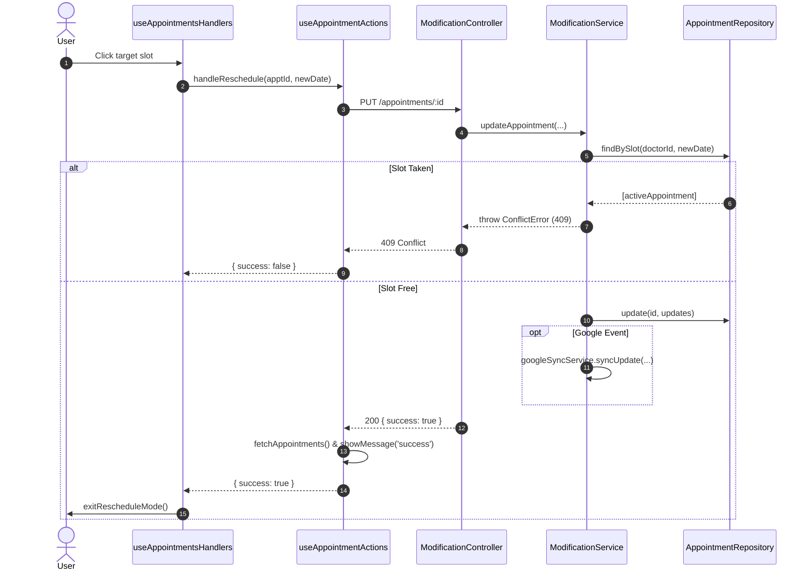

# Technical Design: Reschedule Appointment Flow and Validation

## Technical Approach
Implement robust appointment rescheduling with transactional validation on the backend and consistent state orchestration on the frontend:
1. **Backend Validation & Sync**: In `modificationService.updateAppointment`, check target slot availability with `appointmentRepository.findBySlot` inside the transaction. If occupied by an active appointment (`id !== appt.id && status !== 'cancelled'`), throw `ConflictError`. Free the former slot, occupy the new slot, update date and `status = 'rescheduled'`, and sync changes via `googleSyncService.syncUpdate`.
2. **API Contract**: Update `modification.js` to return `{ success: true, message: "Appointment updated" }`.
3. **Frontend Hook Pipeline**: `useAppointments.rescheduleAppointment` returns `{ success: true, ...res.data }`. `useAppointmentActions.handleReschedule` awaits the call, verifies `result.success`, refreshes via `fetchAppointments()`, displays `t('rescheduled_success')`, and propagates 403 `AUTH_REQUIRED`. `useAppointmentsHandlers` ensures `exitRescheduleMode()` runs on success and implements `handleAdminAuthConfirm` to execute retries with password.

## Architecture Decisions
| Option | Tradeoff | Decision & Rationale |
| :--- | :--- | :--- |
| **Slot Collision**: DB Unique Index vs Service Query | DB index blocks reusing slots of cancelled records. | **Service Query**: Query `findBySlot` inside transaction to filter out `cancelled` appointments, matching `BookingService`. |
| **Google Sync**: EventBus vs Direct Call | EventBus is decoupled but requires new event schemas. | **Direct Call**: Call `googleSyncService.syncUpdate` directly; leverages existing error handling and DB fallback queue. |
| **Admin Auth Retry**: Page Reload vs Action Queue | Reload loses navigation state. | **Action Queue (`retryAction`)**: Store `{ type: 'reschedule', args: [id, newDate] }` and re-dispatch with password on confirm. |

## Sequence Diagram


## Data Flow
```
[Slot Click] -> [handleSlotClick] -> [handleReschedule] -> [PUT /appointments/:id]
                                                                  |
[exitRescheduleMode] <- [200 OK: success] <- [Commit] <- [findBySlot check]
                                                      <- [freeSlot & occupySlot]
                                                      <- [googleSyncService.syncUpdate]
```

## File Changes
| Path | Action | Description |
| :--- | :--- | :--- |
| `server/services/appointments/modificationService.js` | Modify | Add collision check via `findBySlot` (`ConflictError`) and Google sync via `syncUpdate`. |
| `server/controllers/appointments/modification.js` | Modify | Return `{ success: true, message: "Appointment updated" }`. |
| `client/src/features/appointments/hooks/useAppointments.js` | Modify | Ensure `rescheduleAppointment` returns `{ success: true, ...res.data }`. |
| `client/src/features/appointments/hooks/useAppointmentActions.js` | Modify | Support `adminPassword`, trigger `fetchAppointments` + toast on success, return `{ type: 'AUTH_REQUIRED' }` on 403. |
| `client/src/features/appointments/hooks/useAppointmentsHandlers.js` | Modify | Invoke `exitRescheduleMode()` on success in `handleSlotClick`; implement `handleAdminAuthConfirm` retry. |
| `server/services/appointments/modificationService.test.js` | Modify | Unit tests for successful reschedule, slot collision (`ConflictError`), and auth rejection. |
| `client/src/features/appointments/hooks/__tests__/useAppointmentActions.test.js` | Create | Vitest tests for rescheduling hook flows, success feedback, and auth error handling. |

## Interfaces / Contracts
```javascript
// Request: PUT /appointments/:id
{ "appointment_date": "2026-09-15T14:30:00.000Z", "adminPassword": "password" }

// Responses
// 200 OK: { "success": true, "message": "Appointment updated" }
// 409 Conflict: { "error": "Ya existe un turno confirmado en este horario.", "type": "GENERIC_ERROR" }
// 403 Forbidden: { "error": "Requiere autorización de Administrador...", "type": "AUTH_REQUIRED" }
```

## Testing Strategy
| Level | Tool | Target | Coverage Plan |
| :--- | :--- | :--- | :--- |
| **Unit (Server)** | Jest | `modificationService.js` | Success path (slots updated, status set, google sync); collision throws `ConflictError`; auth failure throws `AuthRequiredError`. |
| **Integration (Server)** | Jest | `modification.js` | Verify HTTP 200 `{ success: true }`, HTTP 409 on collision, HTTP 403 on permission error. |
| **Unit (Client)** | Vitest | `useAppointmentActions.js` | Success returns `{ success: true }`, calls `fetchAppointments` and toast; 403 returns `{ type: 'AUTH_REQUIRED' }`; error returns `{ success: false }`. |
| **Integration (Client)** | Vitest | `useAppointmentsHandlers.js` | `handleSlotClick` exits reschedule mode on success, triggers auth modal on 403, and retries via `handleAdminAuthConfirm`. |

## Threat Matrix
| Threat | Applicability | Mitigation |
| :--- | :--- | :--- |
| **Unauthorized Date Override** | High (past/attended appointments) | `checkModificationPermissions` enforces admin authorization on protected appointments. |
| **Double Booking Race Condition** | Medium | Transactional `findBySlot` validation blocks conflicting appointments prior to update. |
| **Google Calendar Drift** | Low | Direct sync via `googleSyncService.syncUpdate` with fallback DB queue on failure. |

## Migration / Rollout
- **Database**: No schema migrations needed.
- **Rollout**: Deploy backend service/controller changes first, then client bundle.
- **Rollback**: Clean git revert of application code.

## Open Questions
None. Scope, interfaces, and error handling are fully determined.
